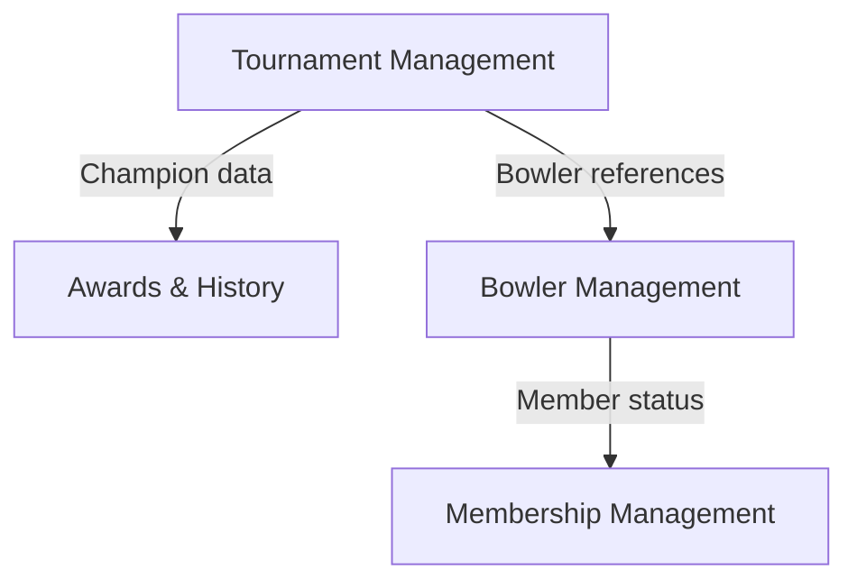
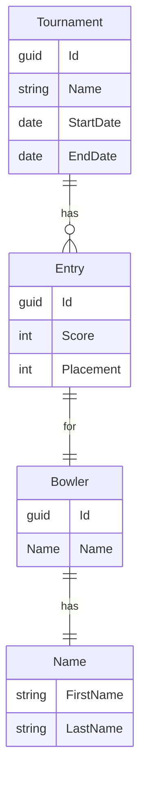
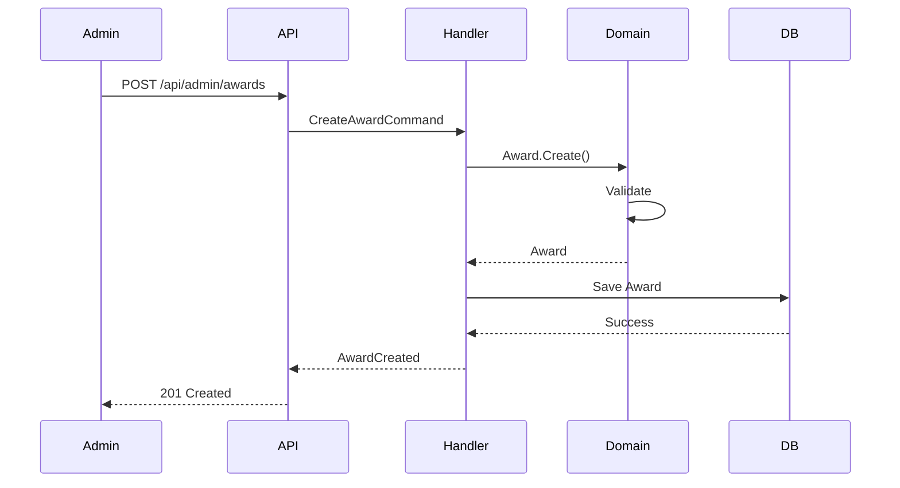

# Jekyll Configuration Reference for GitHub Pages

This reference guide provides common Jekyll configurations and front matter options for NEBA Management System documentation.

## Basic _config.yml

Create a `_config.yml` file in the `docs/` directory:

```yaml
# Site settings
title: NEBA Management System Documentation
description: Administrative guides, domain documentation, and API reference for the NEBA Management System
baseurl: "/neba-management" # Replace with your repo name
url: "https://yourusername.github.io" # Replace with your GitHub Pages URL

# Theme
theme: just-the-docs # Recommended for technical documentation
# or remote_theme: pmarsceill/just-the-docs

# Navigation
nav_enabled: true
nav_sort: nav_order
search_enabled: true

# Footer
footer_content: "Copyright &copy; 2025 New England Bowlers Association. All rights reserved."

# Color scheme
color_scheme: light # or dark

# Enable Mermaid diagrams
mermaid:
  version: "10.6.0"
```

## Front Matter Reference

### Basic Page Front Matter

```yaml
---
layout: default
title: Page Title
nav_order: 1
---
```

### Page with Parent (for nested navigation)

```yaml
---
layout: default
title: Child Page
parent: Parent Page Name
nav_order: 1
---
```

### Page with Grandparent (3-level navigation)

```yaml
---
layout: default
title: Specific Guide
parent: Admin Guides
grand_parent: Documentation
nav_order: 3
---
```

### Index/Landing Page

```yaml
---
layout: default
title: Admin Guides
nav_order: 2
has_children: true
---
```

### Page with Table of Contents

```yaml
---
layout: default
title: Long Document
nav_order: 5
has_toc: true # Enables automatic TOC generation
---
```

### Exclude Page from Navigation

```yaml
---
layout: default
title: Draft Page
nav_exclude: true
search_exclude: true # Also exclude from search
---
```

## Navigation Structure Example

For the NEBA Management System documentation:

**docs/index.md** (Home page)
```yaml
---
layout: default
title: Home
nav_order: 1
description: "NEBA Management System Documentation"
permalink: /
---
```

**docs/admin/index.md** (Admin section landing)
```yaml
---
layout: default
title: Admin Guides
nav_order: 2
has_children: true
---
```

**docs/admin/tournament-setup.md** (Specific admin guide)
```yaml
---
layout: default
title: Tournament Setup
parent: Admin Guides
nav_order: 1
---
```

**docs/domain/index.md** (Domain section landing)
```yaml
---
layout: default
title: Domain Documentation
nav_order: 3
has_children: true
---
```

**docs/domain/ubiquitous-language.md** (Domain terms)
```yaml
---
layout: default
title: Ubiquitous Language
parent: Domain Documentation
nav_order: 1
---
```

## Mermaid Diagram Examples

### Bounded Context Diagram

```markdown
## Bounded Contexts


\```
```

### Entity Relationship Diagram

```markdown
## Domain Model


\```
```

### Sequence Diagram

```markdown
## Award Processing Flow


\```
```

## Callout/Alert Boxes

GitHub Pages with Just-the-Docs theme supports callouts:

```markdown
{: .note }
This is a note callout. Use for helpful information.

{: .important }
This is important. Use for critical information users must know.

{: .warning }
This is a warning. Use for potential issues or risks.

{: .new }
This is new. Use for recently added features or documentation.
```

## Code Block with Title

```markdown
{: .code-example }
> Name Validation Example
>
> ```csharp
> public static Error FirstNameRequired => Error.Validation(
>     code: "Name.FirstName.Required",
>     description: "First name is required."
> );
> ```
```

## Tables with Styling

```markdown
| Error Code | Type | Description |
|:-----------|:-----|:------------|
| `Name.FirstName.Required` | Validation | First name is required |
| `Name.LastName.TooLong` | Validation | Last name exceeds maximum length |
| `Tournament.Entry.InvalidState` | Conflict | Entry is in an invalid state |
{: .table-striped }
```

## Task Lists

```markdown
### Setup Checklist

- [x] Install dependencies
- [x] Configure Jekyll
- [ ] Write admin guides
- [ ] Document domain terms
- [ ] Add API reference
```

## Custom Includes

Create reusable content in `_includes/` directory:

**_includes/error-code-format.md:**
```markdown
Error codes follow the format: `<DomainContext>.<Object>.<Member>.<Rule>`

Example: `Name.FirstName.Required`
```

**Usage in pages:**
```markdown

```

## Link Reference

### Internal Links (within docs)

```markdown
[Admin Guide](./admin/tournament-setup.md)
[Ubiquitous Language](../domain/ubiquitous-language.md)
[Home](/)
```

### Source Code Links

```markdown
[Name.cs](https://github.com/yourusername/neba-management/blob/main/src/backend/Neba.Domain/Bowlers/Name.cs)
```

### Anchor Links (to sections)

```markdown
[Jump to Setup](#setup)
[Error Codes](./ubiquitous-language.md#error-code)
```

## Build and Preview Locally

To preview documentation locally before publishing:

```bash
cd docs
bundle install
bundle exec jekyll serve
```

Visit `http://localhost:4000` to preview.

## Publishing to GitHub Pages

1. Commit documentation to `docs/` directory
2. Push to GitHub
3. Go to repository Settings > Pages
4. Set Source to "Deploy from a branch"
5. Select branch (usually `main`) and `/docs` folder
6. Click Save

Your documentation will be published at `https://yourusername.github.io/neba-management/`

## SEO and Metadata

Add to individual pages for better SEO:

```yaml
---
layout: default
title: Tournament Setup Guide
description: Learn how to set up and configure tournaments in the NEBA Management System
keywords: tournament, setup, admin, NEBA, bowling
---
```
